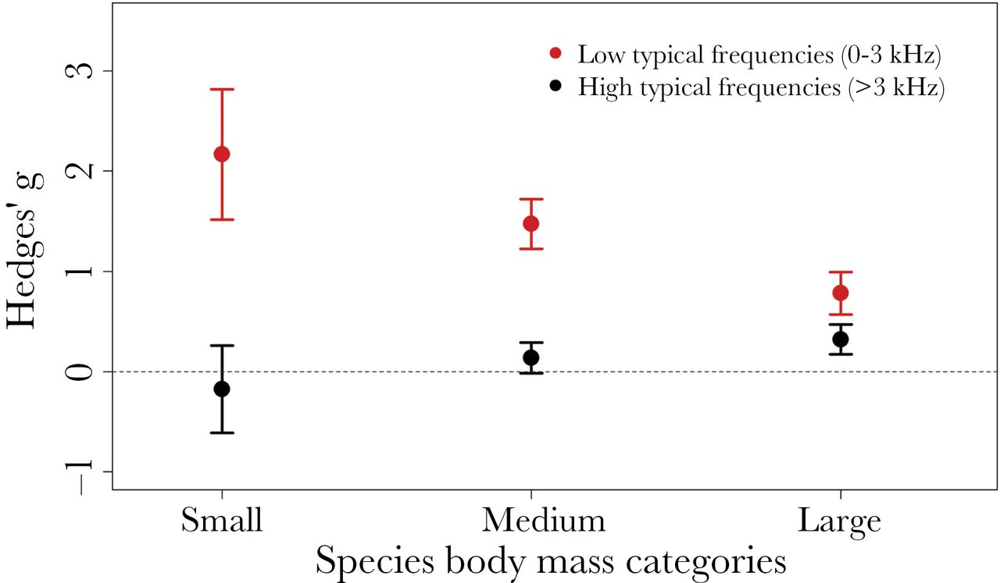
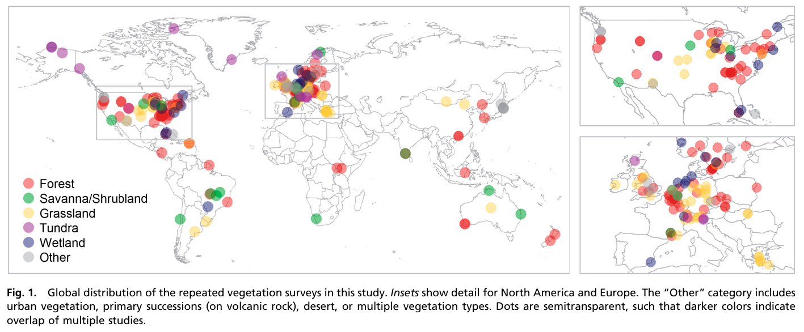
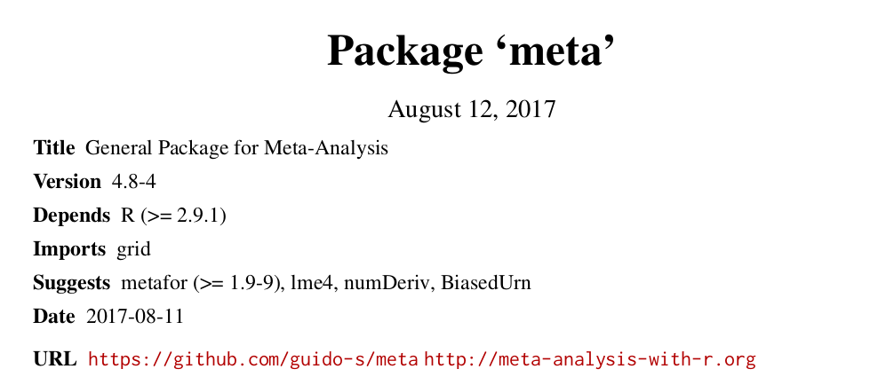
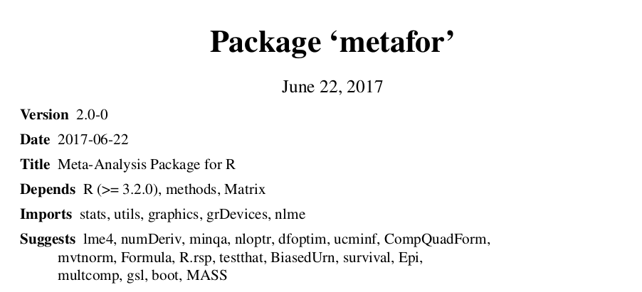
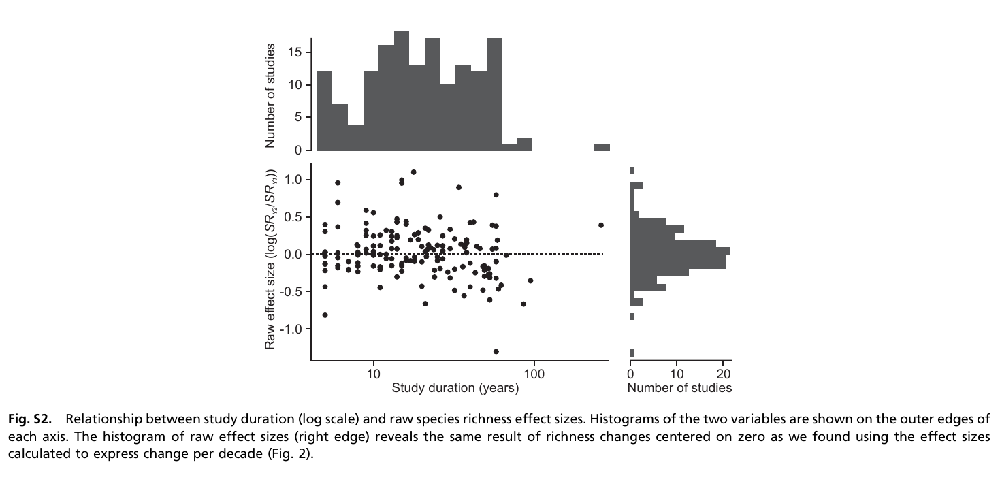

```{r, results = "hide", echo = FALSE, message = FALSE}
knitr::opts_chunk$set(
  fig.align='center',
  tidy=FALSE,
  comment="R>> ",
  size = 'small'
)
library(metafor)
```


# R to visualize your data  

## Why visualize your data?
<br>

<div class="centered">
<i class="fa fa-table fa-4x" aria-hidden="true"></i>
<span style="display:inline-block; width: 80px;"></span>
<i class="fa fa-bar-chart fa-4x" aria-hidden="true"></i>

<i class="fa fa-question-circle fa-4x" aria-hidden="true"></i>

</div>

- summarize information
- check assumptions validity
- many pieces of information at one glance
- ease the understanding

<!-- discuss about how to make it efficient / make your point -->


## Data visualization

[click here kev](http://buckets.peterbeshai.com/app/#/playerView/201935_2015)


## Why use R to do it?

### Workflow

<br><br>

<i class="fa fa-database fa-4x" aria-hidden="true"></i>&nbsp;
<i class="fa fa-long-arrow-right fa-4x" aria-hidden="true"></i>&nbsp;
<i class="fa fa-table fa-4x" aria-hidden="true"></i>&nbsp;
<i class="fa fa-long-arrow-right fa-4x" aria-hidden="true"></i>&nbsp;
<i class="fa fa-cogs fa-4x" aria-hidden="true"></i>&nbsp;


## Why use R to do it?

### Workflow

<br><br>

<i class="fa fa-database fa-4x" aria-hidden="true"></i>&nbsp;
<i class="fa fa-long-arrow-right fa-4x" aria-hidden="true"></i>&nbsp;
<i class="fa fa-table fa-4x" aria-hidden="true"></i>&nbsp;
<i class="fa fa-long-arrow-right fa-4x" aria-hidden="true"></i>&nbsp;
<i class="fa fa-cogs fa-4x" aria-hidden="true"></i>&nbsp;
<i class="fa fa-long-arrow-right fa-4x" aria-hidden="true"></i>&nbsp;
<i class="fa fa-bar-chart fa-4x" aria-hidden="true"></i>


## Why use R to do it?

Here we'll argue why use R for doing your plots:

  - visualizing data  
  - what makes a good graph (some details)  
  - work-flow (data are already in R)
  - base graph / ggplot2 / web graphs (interacting)
  - code / reproducible


## Why use R to do it?

### Different valuable options

<div class="centered">

</div>

- The gridGraphics package [<i class="fa fa-file-pdf-o" aria-hidden="true"></i>](https://journal.r-project.org/archive/2015-1/murrell.pdf)  
- base **VS** ggplot2
- Web-based graphs


## Why use R to do it?

<br>

### Many, many, many packages available

<br>

- http://blog.revolutionanalytics.com/2017/01/cran-10000.html

- https://stackoverflow.blog/2017/10/10/impressive-growth-r/

- [click here Kev](http://revolution-computing.typepad.com/.a/6a010534b1db25970b01b8d2594d25970c-pi)


## Why use R to do it?

```{r arch, echo=FALSE, message=FALSE, fig.height=5.5}
lwdt = 6
par(mar=c(0,0,0,0), lend=2)
plot(c(0,10), c(0,10), axes=F, ann=F, type='n')
lines(c(5,5), c(3.5,8), col='grey60', lwd=lwdt)
lines(c(5,8), c(3.5,3.5), col='grey60', lwd=lwdt)
lines(c(8,8), c(3.5,6.5), col='grey60', lwd=lwdt)
lines(c(2,2), c(2,6.5), col='grey60', lwd=lwdt)
lines(c(2,2), c(2,6.5), col='grey60', lwd=lwdt)
lines(c(2,8), c(6.5,6.5), col='grey60', lwd=lwdt)
lines(c(6.5,6.5), c(2,3.5), col='grey60', lwd=lwdt)
points(c(5,8,5,2,6.5), c(8,5,5,2,2), pch=22, bg='grey25', cex=8)
text(c(5,8,5,2,6.5), c(8,5,5,2,2), labels=paste0('P', 5:1), pch=22, col='grey60', cex=2)
```

## Why use R to do it?

### Few lines of codes

```{r exmap2, eval=FALSE, message=FALSE}
library(raster)
library(mapview)
elvBtn = getData('alt', country='BTN', path='./assets/')
mapview(elvBtn)
```

## Why use R to do it?

### Few lines of codes

```{r exmap2b, echo=FALSE, message=FALSE}
library(raster)
library(mapview)
elvBtn = getData('alt', country='BTN', path='./assets/')
mapview(elvBtn)
```


## Why use R to do it?

### A large community

## Why use R to do it?

<div class="centered">
{width=50%}
</div>


<!-- What do you think? -->


# Common plots used in meta-analyses

## What do we want/need to visualize?

### **Effect Size (ES)** [<i class="fa fa-external-link" aria-hidden="true"></i>](https://qcbs.ca/wiki/meta-analysis-workshop)

  - log risk ratios,
  - log odds ratios,
  - ...,
  - non-standard ES

### **Studies**

  - by author
  - by region
  - by species


<!-- you want to explain difference / heterogeneity of ES trying to understand why and
that's why we should use random effect -->
<!-- temporal drift -->

## Effect size -- Funnel plot

```{r funnelplot0, echo=FALSE, message=FALSE}
par(mar=c(5,4,1,2))
res <- rma(yi, vi, data=dat.hackshaw1998, measure="OR")
taf <- trimfill(res)
funnel(taf)
```

http://www.metafor-project.org/doku.php/plots:funnel_plot_with_trim_and_fill


## Effect size -- Forest plot

<div class="columns-2">
</img>

<br><br><br><br><br><br><br><br>
</img>
Vellend *et. al* 2013
</div>  


## Effect size -- Forest plot

```{r forestEx, echo=FALSE}
### simulate some data
set.seed(1987)
k <- 100
vi <- rchisq(k, df=1) * .03
yi <- rnorm(k, rnorm(k, 0.5, 0.4), sqrt(vi))

### fit RE model
res <- rma(yi, vi)

### create plot
forest(yi, vi,
       xlim=c(-2.5,3.5),        ### adjust horizontal plot region limits
       subset=order(yi),        ### order by size of yi
       slab=NA, annotate=FALSE, ### remove study labels and annotations
       efac=0,                  ### remove vertical bars at end of CIs
       pch=19,                  ### changing point symbol to filled circle
       col="gray40",            ### change color of points/CIs
       psize=2,                 ### increase point size
       cex.lab=1, cex.axis=1,   ### increase size of x-axis title/labels
       lty=c("solid","blank"))  ### remove horizontal line at top of plot

### draw points one more time to make them easier to see
points(sort(yi), k:1, pch=19, cex=0.5)

### add summary polygon at bottom and text
addpoly(res, mlab="", annotate=FALSE, cex=1)
text(-2, -2, "RE Model", pos=4, offset=0, cex=1)
```

http://www.metafor-project.org/doku.php/plots:forest_plot_with_subgroups


## Effect size -- Radial plot

```{r radial, echo=FALSE, message=FALSE}
### adjust margins so the space is better used
par(mar=c(5,4,0,2))
### fit fixed-effects model
res <- rma(yi, vi, data=dat.hackshaw1998, method="FE")
### draw radial plot
radial(res)
```

http://www.metafor-project.org/doku.php/plots:radial_plot


## Effect size -- L'Abbé plot

```{r labbe, echo=FALSE, message=FALSE}
### decrease margins so the full space is used
par(mar=c(5,4,1,2))
### fit random-effects model
res <- rma(ai=tpos, bi=tneg, ci=cpos, di=cneg, data=dat.bcg, measure="RR")
 ### draw L'Abbé plot
labbe(res)
```

http://www.metafor-project.org/doku.php/plots:labbe_plot


## Effect size -- relevant categories

<div class="centered">
</img>
</div>

Roca *et al.* 2016


## Number of Study & effect size

<div class="centered">
</img>
</div>

Vellend *et al.* 2013


## Number of Study & geography

<br>
<div class="centered">
</img>
</div>

Vellend *et al.* 2013


# Common plots used in meta-analyses with R


## R packages for meta-analyses

  - [click here kev](https://cran.r-project.org/web/views/MetaAnalysis.html)

  - `install.packages("ctv"); ctv::install.views("MetaAnalysis")`


## Meta vs Metafor -- briefly




## Meta vs Metafor -- briefly




## Meta vs Metafor -- support

- Guido Schwarzer author of [`meta`](https://cran.r-project.org/web/packages/meta/meta.pdf)

- Schwarzer, Guido, James R. Carpenter, and Gerta Rücker. [Meta-Analysis with R](http://www.springer.com/us/book/9783319214153).

<br><br>

- Wolfgang Viechtbauer author [`metafor`](https://cran.r-project.org/web/packages/metafor/metafor.pdf)

- [click here kev](http://www.metafor-project.org/doku.php/plots)


## Meta -- workflow

1. **meta**:
    - `metabin()`


```
Arguments:

 event.e: Number of events in experimental group.
     n.e: Number of observations in experimental group.
 event.c: Number of events in control group.
     n.c: Number of observations in control group.
```


## Meta -- workflow

###  **meta**:
    - `metabin()` / `metagen()`


```
Arguments:

      TE: Estimate of treatment effect.
    seTE: Standard error of treatment estimate.
```


## Meta -- workflow

### **meta**:
    - `metabin()` / `metagen()`
    - `funnel`, `forest`, ...

```r
install.packages('meta')
library(meta)
data(Olkin95)
# ?Olkin95
meta1 <- metabin(event.e, n.e, event.c, n.c,
                  data=Olkin95, subset=c(41,47,51,59),
                  sm="RR", method="I",
                  studlab=paste(author, year))

forest(meta1)
```


## Meta -- workflow

```{r forestmeta, echo=FALSE, results='asis'}
data(Olkin95, package='meta')
knitr::kable(head(Olkin95))
```


## Meta -- workflow


```{r forestmetab, echo=FALSE}
data(Olkin95, package='meta')
meta1 <- meta::metabin(event.e, n.e, event.c, n.c,
                  data=Olkin95, subset=c(41,47,51,59),
                  sm="RR", method="I",
                  studlab=paste(author, year))
meta::forest(meta1)
```


## Metafor -- workflow

- [click here kev](http://www.metafor-project.org/doku.php/plots)


## Metafor -- workflow

- Calculate effect size: `escalc()`

- Perform analysis: `rma()`

- Plots: `funnel()`, `forest()`, `labbe()`, ...


## Metafor -- example

```{r metafor, eval=FALSE, message=FALSE}
install.packages('metafor')
library('metafor')
```

```{r metafor1, echo=FALSE, message=FALSE}
library('metafor')
```


## Metafor -- example

```r
r<-c(0.5,0.6,0.4,0.2,0.7,0.45)
n<-c(40,90,25,400,60,50)
studynames<-c(1,2,3,4,5,6)
b<-data.frame(r,n,studynames)
eszcor <- escalc(measure="ZCOR", ri=r, ni=n, data=b)
FEmodel<-rma(yi=yi, vi=vi, data=eszcor, method="FE")
#forest plot fixed-effect model: pooled effect size,
forest(FEmodel)
```


## Metafor -- example

```{r, metaforExa}
r<-c(0.5,0.6,0.4,0.2,0.7,0.45)
n<-c(40,90,25,400,60,50)
studynames<-c(1,2,3,4,5,6)
b<-data.frame(r,n,studynames)
```

## Metafor -- example

```{r, metaforExb}
knitr::kable(head(b))
```


## Metafor -- example

```{r, metaforExc}
eszcor <- escalc(measure="ZCOR", ri=r, ni=n, data=b)
class(eszcor)
```

## Metafor -- example

```{r, metaforExd}
FEmodel<-rma(yi=yi, vi=vi, data=eszcor, method="FE")
class(FEmodel)
```

## Metafor -- example

```{r, metaforExe}
forest(FEmodel)
```


## Metafor -- example

```{r, metaforExea}
forest(FEmodel,transf=transf.ztor)
```


## Metafor -- example

```{r, metaforExf}
funnel(FEmodel, yaxis="vinv", main="Inverse Sampling Variance")
```


## Pros and Cons

### Pros

- do everything for you
- good-looking plots with a few line of plot


### Cons

- standard ES
- not fully customizable
- not for ecologists


# Custom your plot

## graphics or grid?

<div class="centered">

</div>

[ggplot2](http://ggplot2.tidyverse.org/reference/)


## Few tips

- `par()`
- `plot()`, `barplot()`, `funnel()`


##

```{r tips1}
npt <- 15
vecX <- 1:npt
vecY <- runif(length(vecX))
```

##

```{r tips2}
plot(vecX, vecY)
```

##

```{r tips3}
plot(vecX, vecY, xlim=c(0,15)+.5)
```

##

```{r tips4}
plot(vecX, vecY, xlim=c(0,15)+.5, pch=19)
```

##

```{r tips5}
plot(vecX, vecY, xlim=c(0,15)+.5, pch=19, col="#0f7aa2")
```


##

```{r tips6}
plot(vecX, vecY, xlim=c(0,15)+.5, pch='S', col="#0f7aa2")
```

##

```{r tips7}
plot(vecX, vecY, xlim=c(0,15)+.5, type='h', col="#0f7aa2")
```

##

```{r tips7b}
plot(vecX, vecY, xlim=c(0,15)+.5, type='h', col="#0f7aa2", lwd=12)
```

##

```{r tips7c}
par(lend=2); plot(vecX, vecY, xlim=c(0,15)+.5, type='h', col="#0f7aa2", lwd=12)
```


##

```{r tips8}
par(las=1)
plot(vecX, vecY, xlim=c(0,15)+.5, pch=19, col="#0f7aa2")
```


##

```{r tips9}
par(las=1)
plot(vecX, vecY, xlim=c(0,15)+.5, pch=19, col="#0f7aa2")
abline(v=c(0.5,15.5), lty=2)
```


##

```{r tips10}
par(las=1, xaxs='i')
plot(vecX, vecY, xlim=c(0,15)+.5, pch=19, col="#0f7aa2")
abline(v=c(0.5,15.5), lty=2)
```

##

```{r tips11}
vCol <- rep(1, npt)
vCol[c(2,5,8,9)] <- 2
vSize <- 1+2*runif(npt)
```


##

```{r tips12}
par(las=1, xaxs='i')
plot(vecX, vecY, xlim=c(0,15)+.5, pch=19, col=c("#0f7aa2", '#a70d72')[vCol])
```

##

```{r tips13}
par(las=1, xaxs='i')
plot(vecX, vecY, xlim=c(0,15)+.5, pch=19, col=c("#0f7aa2", '#a70d72')[vCol], cex=vSize)
```

##

```{r tips14}
par(las=1, xaxs='i')
plot(vecX, vecY, xlim=c(0,15)+.5, pch=19, col=c("#0f7aa2", '#a70d72')[vCol], cex=vSize)
abline(lm(vecY~vecX), col=2)
```


##

```{r tips15}
par(las=1, xaxs='i', mfrow=c(2,2))
for (i in 1:4){
  plot(vecX, vecY, xlim=c(0,15)+.5, pch=19, col=c("#0f7aa2", '#a70d72')[vCol], cex=vSize)
}
```


##

```{r tips16, eval=F}
par(las=1, xaxs='i', mfrow=c(2,2), mar=c(2,2,1,1), oma=c(2,2,0,0))
##--
plot(vecX, vecY, xlim=c(0,15)+.5, pch=19, col=c("#0f7aa2", '#a70d72')[vCol], cex=vSize,
ann=F)
##--
plot(vecX, vecY, xlim=c(0,15)+.5, pch=19, col=c("#0f7aa2", '#a70d72')[vCol], cex=vSize,
ann=F)
##--
plot(vecX, vecY, xlim=c(0,15)+.5, pch=19, col=c("#0f7aa2", '#a70d72')[vCol], cex=vSize,
ann=F)
##--
plot(vecX, vecY, xlim=c(0,15)+.5, pch=19, col=c("#0f7aa2", '#a70d72')[vCol], cex=vSize,
ann=F)
##--
mtext(1, text='Time', outer=T)
par(las=0)
mtext(2, text='Variable', outer=T)
```

##

```{r tips16b, echo=F}
par(las=1, xaxs='i', mfrow=c(2,2), mar=c(2,2,1,1), oma=c(3,3,0,0))
##--
plot(vecX, vecY, xlim=c(0,15)+.5, pch=19, col=c("#0f7aa2", '#a70d72')[vCol], cex=vSize,
ann=F)
##--
plot(vecX, vecY, xlim=c(0,15)+.5, pch=19, col=c("#0f7aa2", '#a70d72')[vCol], cex=vSize,
ann=F)
##--
plot(vecX, vecY, xlim=c(0,15)+.5, pch=19, col=c("#0f7aa2", '#a70d72')[vCol], cex=vSize,
ann=F)
##--
plot(vecX, vecY, xlim=c(0,15)+.5, pch=19, col=c("#0f7aa2", '#a70d72')[vCol], cex=vSize,
ann=F)
##--
mtext(1, text='Time', outer=T)
mtext(2, text='Variable', outer=T, line=1.5)
```


##

```{r tips17a}
layout(matrix(c(2,1,0,3), 2), widths=c(1,.5), heights=c(.5,1))
layout.show(3)
```


##

```r
layout(matrix(c(2,1,0,3), 2), widths=c(1,.5), heights=c(.5,1))
par(mar=c(4,4,1,1))
plot(vecX, vecY, xlim=c(0,15)+.5, pch=19, col=c("#0f7aa2", '#a70d72')[vCol], cex=vSize,
ann=F)
##--
plot(vecX, vecY, xlim=c(0,15)+.5, pch=19, col=c("#0f7aa2", '#a70d72')[vCol], cex=vSize,
ann=F)
##--
plot(vecX, vecY, xlim=c(0,15)+.5, pch=19, col=c("#0f7aa2", '#a70d72')[vCol], cex=vSize,
ann=F)
```

##

```{r tips17b, echo=F}
layout(matrix(c(2,1,0,3), 2), widths=c(1,.5), heights=c(.5,1))
par(mar=c(4,4,1,1))
plot(vecX, vecY, xlim=c(0,15)+.5, pch=19, col=c("#0f7aa2", '#a70d72')[vCol], cex=vSize,
ann=F)
##--
plot(vecX, vecY, xlim=c(0,15)+.5, pch=19, col=c("#0f7aa2", '#a70d72')[vCol], cex=vSize,
ann=F)
##--
plot(vecX, vecY, xlim=c(0,15)+.5, pch=19, col=c("#0f7aa2", '#a70d72')[vCol], cex=vSize,
ann=F)
```


## Example funnel plot

```{r, customa}
funnel(FEmodel, yaxis="vinv", main="Inverse Sampling Variance")
```


## Example funnel plot

```r
par(las=1, mar=c(5,6,4,1), mgp=c(4,1,0))
funnel(FEmodel, yaxis="vinv", main="Inverse Sampling Variance", col="#0f7aa2",
back='white')
legend('topright', legend='mypoints', pch=19, col="#0f7aa2", bty='n')
```


## Example funnel plot

```{r, echo=FALSE, customb}
par(las=1, mar=c(5,6,4,1), mgp=c(4,1,0))
funnel(FEmodel, yaxis="vinv", main="Inverse Sampling Variance", col="#0f7aa2",
back='white')
legend('topright', legend='mypoints', pch=19, col="#0f7aa2", bty='n')
```


<!-- before after  -->

# Questions?


# Let's practice


## Reproduce figures from

<br>

### Vellend *et al.* 2013

- Paper is available on line [<i class="fa fa-external-link" aria-hidden="true"></i>](http://www.pnas.org/content/110/48/19456.abstract)

- Data available on line as well [Dataset S1](http://www.pnas.org/lookup/suppl/doi:10.1073/pnas.1312779110/-/DCSupplemental/sd01.xls)


### Roca *et al.* 2016

- Paper available [online](https://academic.oup.com/beheco/article/27/5/1269/1743508)

- Data available on [Github](https://github.com/KevCaz/graphsMetaAnalyses/blob/master/docs/data/datRoca.csv)


## Roca *et al.* 2016

<div class="centered">
</img>
</div>

Roca *et al.* 2016


## Figure S2

<div class="centered">
</img>
</div>

Vellend *et al.* 2013


## Figure 3

<div class="columns-2">
</img>
<br><br><br><br><br><br><br><br>
</img>
</div>  

Vellend *et al.* 2013 **wrong data on GH**


# Extra


# Resources

## Useful links

- [task view on CRAN](https://cran.r-project.org/web/views/MetaAnalysis.html)

- 2 books:

  1. Chen, Ding-Geng, and Karl E. Peace. [Applied Meta-Analysis with R](https://www.crcpress.com/Applied-Meta-Analysis-with-R/Chen-Peace/p/book/9781466505995). Chapman & Hall/CRC Biostatistics Series. Boca Raton: CRC Press/Taylor & Francis Group, 2013.  + [companion website](Website http://portal.uni-freiburg.de/imbi/lehre/lehrbuecher/meta-analysis-with-r)

  2. Schwarzer, Guido, James R. Carpenter, and Gerta Rücker. [Meta-Analysis with R](http://www.springer.com/us/book/9783319214153). Use R! Cham: Springer International Publishing, 2015. https://doi.org/10.1007/978-3-319-21416-0.


# That's all folks
