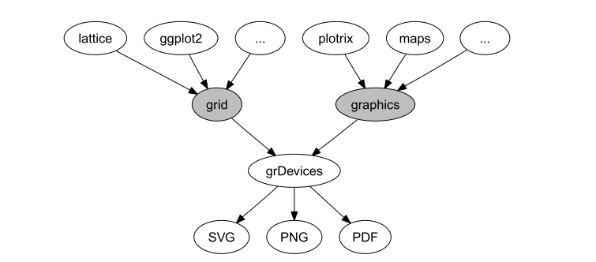
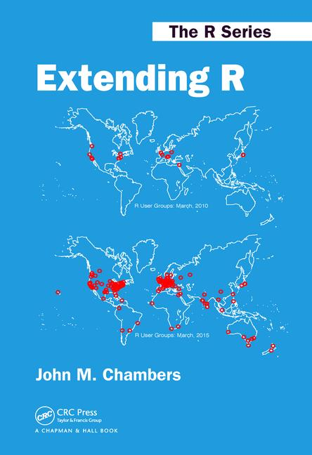
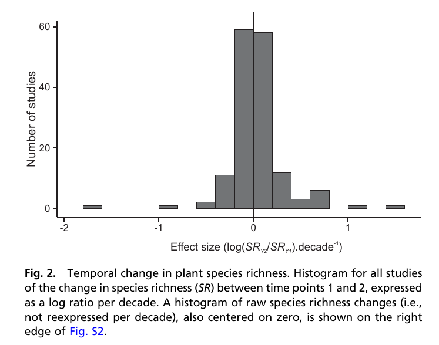
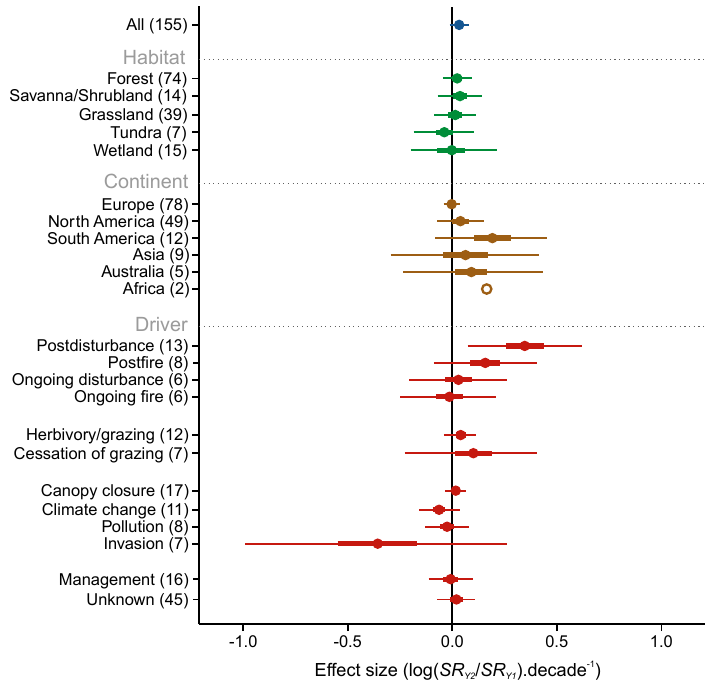
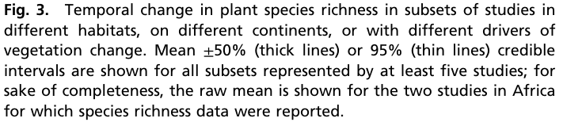

```{r, results = "hide", echo = FALSE, message = FALSE}
knitr::opts_chunk$set(
  fig.align='center',
  tidy=FALSE,
  comment="R>> ",
  size = 'small'
)
```


# R to visualize your data  

## Why visualize your data?
<br>

<div class="centered">
<i class="fa fa-table fa-4x" aria-hidden="true"></i>
<span style="display:inline-block; width: 80px;"></span>
<i class="fa fa-bar-chart fa-4x" aria-hidden="true"></i>

<i class="fa fa-question-circle fa-4x" aria-hidden="true"></i>

</div>

- summarize information
- check assumptions validity
- many pieces of information at one glance
- ease the understanding

<!-- discuss about how to make it efficient / make your point -->


## Why use R to do it?

### Workflow

<br><br>

<i class="fa fa-database fa-4x" aria-hidden="true"></i>&nbsp;
<i class="fa fa-long-arrow-right fa-4x" aria-hidden="true"></i>&nbsp;
<i class="fa fa-table fa-4x" aria-hidden="true"></i>&nbsp;
<i class="fa fa-long-arrow-right fa-4x" aria-hidden="true"></i>&nbsp;
<i class="fa fa-cogs fa-4x" aria-hidden="true"></i>&nbsp;


## Why use R to do it?

### Workflow

<br><br>

<i class="fa fa-database fa-4x" aria-hidden="true"></i>&nbsp;
<i class="fa fa-long-arrow-right fa-4x" aria-hidden="true"></i>&nbsp;
<i class="fa fa-table fa-4x" aria-hidden="true"></i>&nbsp;
<i class="fa fa-long-arrow-right fa-4x" aria-hidden="true"></i>&nbsp;
<i class="fa fa-cogs fa-4x" aria-hidden="true"></i>&nbsp;
<i class="fa fa-long-arrow-right fa-4x" aria-hidden="true"></i>&nbsp;
<i class="fa fa-bar-chart fa-4x" aria-hidden="true"></i>


## Why use R to do it?

Here we'll argue why use R for doing your plots:

  - visualizing data  
  - what makes a good graph (some details)  
  - work-flow (data are already in R)
  - base graph / ggplot2 / web graphs (interacting)
  - code / reproducible


## Why use R to do it?

### Many ways to visualize

<div class="centered">

</div>

- The gridGraphics package [<i class="fa fa-file-pdf-o" aria-hidden="true"></i>](https://journal.r-project.org/archive/2015-1/murrell.pdf)  
- Web-based graphs


## Why use R to do it?

<br>

### Many, many, many packages available

<br>

- http://blog.revolutionanalytics.com/2017/01/cran-10000.html

- https://stackoverflow.blog/2017/10/10/impressive-growth-r/

- [click here Kev](http://revolution-computing.typepad.com/.a/6a010534b1db25970b01b8d2594d25970c-pi)


## Why use R to do it?

```{r arch, echo=FALSE, message=FALSE}
lwdt = 6
par(mar=c(0,0,0,0), lend=2)
plot(c(0,10), c(0,10), axes=F, ann=F, type='n')
lines(c(5,5), c(3.5,8), col='grey60', lwd=lwdt)
lines(c(5,8), c(3.5,3.5), col='grey60', lwd=lwdt)
lines(c(8,8), c(3.5,6.5), col='grey60', lwd=lwdt)
lines(c(2,2), c(2,6.5), col='grey60', lwd=lwdt)
lines(c(2,2), c(2,6.5), col='grey60', lwd=lwdt)
lines(c(2,8), c(6.5,6.5), col='grey60', lwd=lwdt)
lines(c(6.5,6.5), c(2,3.5), col='grey60', lwd=lwdt)
points(c(5,8,5,2,6.5), c(8,5,5,2,2), pch=22, bg='grey25', cex=8)
text(c(5,8,5,2,6.5), c(8,5,5,2,2), labels=paste0('P', 5:1), pch=22, col='grey60', cex=2)
```

## Why use R to do it?

### Few lines of codes

```{r exmap2, eval=FALSE, message=FALSE}
library(raster)
library(mapview)
elvBtn = getData('alt', country='BTN', path='./assets/')
mapview(elvBtn)
```

## Why use R to do it?

### Few lines of codes

```{r exmap2b, echo=FALSE, message=FALSE}
library(raster)
library(mapview)
elvBtn = getData('alt', country='BTN', path='./assets/')
mapview(elvBtn)
```


## Why use R to do it?

### A large community

## Why use R to do it?

<div class="centered">
{width=50%}
</div>


# Common plots used in meta-analyses with R

## What do we want/need to visualize?

1. **Effect size**:
  - log risk ratios
  - log odds ratios
  - risk differences
  - mean differences,
  - standardized mean differences
  - ...

2. **Number of study**:
  - by author
  - by region
  - by species


### Effect size

https://en.wikipedia.org/wiki/Effect_size#Difference_family:_Effect_sizes_based_on_differences_between_means


  - against

- studies + results
- aim?

- effect size
- risk ratio
- influence of certain study/author/group/country


## Use R


## R packages for meta-analyses

  - [click here kev](https://cran.r-project.org/web/views/MetaAnalysis.html)

  - `install.packages("ctv"); ctv::install.views("MetaAnalysis")`


## Meta vs Metafor 

- Guido Schwarzer author of [`meta`](https://cran.r-project.org/web/packages/meta/meta.pdf)

- Schwarzer, Guido, James R. Carpenter, and Gerta Rücker. [Meta-Analysis with R](http://www.springer.com/us/book/9783319214153).

<br><br>

- Wolfgang Viechtbauer author [`metafor`](https://cran.r-project.org/web/packages/metafor/metafor.pdf)

- [click here kev](http://www.metafor-project.org/doku.php/plots)


## Meta vs Metafor


## Problem!

- Everything you need is online

- A problem... just google it!

- **How can we help you?**

- [click here kev](http://www.metafor-project.org/doku.php/plots)


## Install packages

```{r metafor, eval=FALSE, message=FALSE}
install.packages('metafor')
library('metafor')
```

```{r metafor1, echo=FALSE, message=FALSE}
library('metafor')
```

## `rma()`

```{r rma, eval=FALSE, message=FALSE}
?rma
```


## Funnel plot

```{r funnelplot, echo=FALSE, message=FALSE}
### decrease margins so the full space is used
par(mar=c(5,4,1,2))

### fit random-effects model
res <- rma(yi, vi, data=dat.hackshaw1998, measure="OR")

### carry out trim-and-fill analysis
taf <- trimfill(res)
```

## Funnel plot

```{r funnelplotb, echo=FALSE, message=FALSE}
### decrease margins so the full space is used
par(mar=c(5,4,1,2))

### fit random-effects model
res <- rma(yi, vi, data=dat.hackshaw1998, measure="OR")

### carry out trim-and-fill analysis
taf <- trimfill(res)

### draw funnel plot with missing studies filled in
funnel(taf)
```


## Funnel plot -- version 2

```{r funnelplot2, echo=FALSE, message=FALSE}
### fit fixed-effects model
res <- rma(yi, vi, data=dat.hackshaw1998, measure="OR", method="FE")

funnel(res, yaxis="vi", main="Sampling Variance")
# funnel(res, yaxis="seinv", main="Inverse Standard Error")
# funnel(res, yaxis="vinv", main="Inverse Sampling Variance")
```

## Funnel plot -- version 3

```{r funnelplot2b, echo=FALSE, message=FALSE}
### fit fixed-effects model
res <- rma(yi, vi, data=dat.hackshaw1998, measure="OR", method="FE")

funnel(res, yaxis="seinv", main="Inverse Standard Error")
# funnel(res, yaxis="vinv", main="Inverse Sampling Variance")
```


## Forest plot

```{r forestplot, echo=FALSE}
### decrease margins so the full space is used
par(mar=c(4,4,1,2))

### calculate (log) risk ratios and corresponding sampling variances
dat <- escalc(measure="RR", ai=tpos, bi=tneg, ci=cpos, di=cneg, data=dat.bcg)

### fit random-effects models
res <- rma(yi, vi, data=dat, slab=paste(author, year, sep=", "))

### cumulative meta-analysis (in the order of publication year)
tmp <- cumul(res, order=order(dat$year))

### cumulative forest plot
forest(tmp, xlim=c(-4,2), at=log(c(0.125, 0.25, 0.5, 1, 2)),
       atransf=exp, digits=c(2,3), cex=0.75)

### switch to bold font
par(cex=0.75, font=2)

### add column headings to the plot
text(-4, 15, "Author(s) and Year",  pos=4)
text( 2, 15, "Risk Ratio [95% CI]", pos=2)
```


# Custom your plot

## Few tips

<div class="centered">

</div>

## Few tips

- Axis
- Legend
- points
- lines
- colors
- text


# Let's practice

## Reproduce the figures in Vellend et al. 2013

Paper is available on line [<i class="fa fa-external-link" aria-hidden="true"></i>](http://www.pnas.org/content/110/48/19456.abstract)


## Figure 2

<div class="centered">
</img>
</div>

## Figure 3


<div class="columns-2">
</img>
<br><br><br><br><br><br><br><br>
</img>
</div>  


# Let's have some fun

## WordCloud

```{r wrodcloud, eval=FALSE, message=FALSE}
library(wordcloud2)
wordcloud2(demoFreq)
wordcloud2(demoFreq, size = 2)
```

https://github.com/inSileco/wordcloud/blob/master/ourWordcloud.R

## WordCloud

```{r wrodcloud2, echo=FALSE, message=FALSE}
library(wordcloud2)
wordcloud2(demoFreq[1:200,], color=rep(c("#8c8c8c", "#4c4e4f"), 100))
```


## Network of co-authors

```{r network, echo=FALSE, message=FALSE}
library(networkD3)
Source <- c("A", "A", "A", "A", "B", "B", "C", "C", "D")
Target <- c("B", "C", "D", "J", "E", "F", "G", "H", "I")
NetworkData <- data.frame(Source, Target)
# Create graph
simpleNetwork(NetworkData)
```

igraph


# Resources

## Useful links

- [task view on CRAN](https://cran.r-project.org/web/views/MetaAnalysis.html)
- at least 2 books:
  1. Chen, Ding-Geng, and Karl E. Peace. [Applied Meta-Analysis with R](https://www.crcpress.com/Applied-Meta-Analysis-with-R/Chen-Peace/p/book/9781466505995). Chapman & Hall/CRC Biostatistics Series. Boca Raton: CRC Press/Taylor & Francis Group, 2013.  + [companion website](Website http://portal.uni-freiburg.de/imbi/lehre/lehrbuecher/meta-analysis-with-r)

  2. Schwarzer, Guido, James R. Carpenter, and Gerta Rücker. [Meta-Analysis with R](http://www.springer.com/us/book/9783319214153). Use R! Cham: Springer International Publishing, 2015. https://doi.org/10.1007/978-3-319-21416-0.


# That's all folks


<!-- URL <- paste0('https://cdn.rawgit.com/christophergandrud/networkD3/',
               'master/JSONdata/energy.json')
 energy <- jsonlite::fromJSON(URL)

 # Plot
 sankeyNetwork(Links = energy$links, Nodes = energy$nodes, Source = 'source',
              Target = 'target', Value = 'value', NodeID = 'name',
              units = 'TWh', fontSize = 12, nodeWidth = 30) -->
